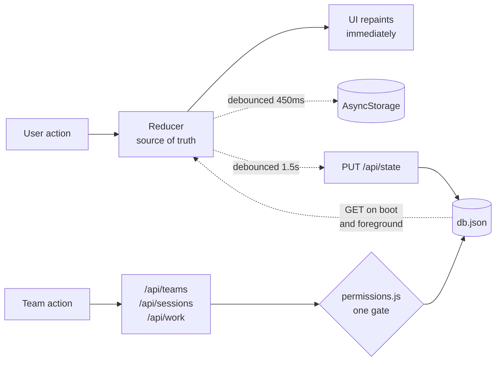

# NOTenough

**A fitness habit tracker for people who keep moving the bar.** Daily goals with local reminders, a
runner's stopwatch and interval timer, streak history, and an offline-first sync layer over a small
Node API.

The premise is in the name: when a target becomes comfortable, the app raises it.


| Today | Daily goals | Stopwatch |
|---|---|---|
|  |  |  |

| Intervals | Progress | Menu |
|---|---|---|
|  |  |  |

---

## Contents

- [Run it](#run-it) · [What it does](#what-it-does) · [Success Journey](#success-journey) · [Teams and coaching](#teams-and-coaching) · [Architecture](#architecture)
- [How the hard parts work](#how-the-hard-parts-work) — [sync](#offline-first-sync) · [auth](#auth-and-sessions) · [reminders](#reminders-that-cannot-drift) · [storage](#a-json-file-that-behaves-like-a-database)
- [Performance](#performance) · [Verification](#verification) · [Privacy](PRIVACY.md) · [Known limits](#known-limits)

---

## Run it

One command, no configuration, no database to install.

```bash
npm run dev     # starts the API, then Metro — scan the QR with Expo Go
```

That is the path for testing on a real phone: it health-checks the API before
Metro takes over the terminal, prints the QR where you can scan it, and stops
both on Ctrl+C. Your phone needs to be on the same Wi-Fi. **No Expo account is
required** — Expo Go loads the bundle straight off your LAN.

Or run the two halves yourself:

```bash
# 1 — API
cd server && npm install && npm start     # http://localhost:4137

# 2 — app
npm install && npx expo start             # scan the QR with Expo Go
```

The app finds the API by itself: it reuses the LAN address Metro is already serving from, which is
by definition reachable from a physical phone. Set `EXPO_PUBLIC_API_URL` to override.

```bash
npm run typecheck          # strict TypeScript, no errors
npm run web                # run it in a browser instead
cd server && npm run smoke # 22 checks against the running API
npm run e2e                # 27 checks driving the real UI (needs `npm run web`)
```

---

## What it does

- **Daily goals** measured in minutes, reps, distance or a simple check-off, each with its own
  target, colour, icon and reminder time. One-tap templates for the common ones.
- **Local notifications** per goal, rebuilt from app state on every sign-in so the OS schedule
  cannot drift after a reinstall or a timezone change.
- **A runner's timer** — stopwatch with laps and splits, plus a work/recover interval mode with
  haptics on every phase change. The screen stays awake while it runs.
- **Progress** — current and best streak, a 7-day completion chart, a 4-week heat grid, and run
  history with pace.
- **Accounts** with a real backend, and a session that keeps working when the network does not.
- **3 Victories** — nine fixed daily goals across body, mind and spirit, with custom targets.
- **Success Journey** — the paper training workbook, as an app: a page per day, a workout
  builder over a searchable movement library, benchmarks you re-test, body measurements with
  trend lines, and standing habits. See below.
- **Teams and coaching** — coaches build sessions and hand them to a squad; athletes see the work
  on Today and log what they actually did. A coach sees only the work they set. See below.

### Success Journey

A daily workbook that opens on today and asks for almost nothing.

- **Today's page** — a theme, one decision, one habit, and six Plus One dimensions. Every field
  is optional; a single ticked box is a finished day. Autosaves on a pause, on blur, on leaving
  the screen and on backgrounding, so there is no Save button anywhere.
- **Workout builder** — M/G/W tags, rounds, movement lines with search over a seeded catalogue
  you can extend, and a free-text result so any scoring style fits.
- **Benchmarks** — 31 seeded tests plus your own. The measurement type decides both how a result
  is entered and which direction counts as a personal best.
- **Measurements** — weight and seven optional readings, charted once there are two of them,
  in kg/cm or lb/in. Nothing is prescribed and no target is suggested.
- **Habits** — adopt a suggestion or write your own, tick daily, keep the streak. Stopping one
  archives it and keeps every day you already ticked.
- **Onboarding** — three screens, all skippable. The health questions sit behind an explicit
  "why we ask" gate and never leave the device. See [PRIVACY.md](PRIVACY.md).

Seed catalogues for movements, benchmarks and habits are plain JSON in
`src/state/journey/data/`, merged at read time so replacing a file reaches every existing
install rather than stranding a stale copy per user.

---

## Teams and coaching

One account type. There is no `role` column anywhere: roles are **team-scoped memberships**, so the
same person can coach one squad and train in another, and a solo user simply has none — which is
what keeps the whole feature invisible to them rather than present and disabled.

- **Creating a team** is available to every account and is the only way to become a coach. Athletes
  join with a six-character invite code from an alphabet with no O/0 or I/1, because it gets read
  aloud across a gym.
- **Sessions** are the one concept. A reusable plan is a session with no date — same fields, same
  editor — so a coach learns one noun and two verbs rather than two overlapping ideas. Templates
  copy their tasks on use, so editing one never rewrites work already handed out.
- **Handing out** is idempotent: it creates only what is missing, so adding a latecomer and pressing
  the button again gives them their rows without duplicating anyone else's.
- **Logging is honest.** Someone who rowed 18 of 20 records 18 and can still mark it done. `done` is
  stored, never inferred from whether the number reached the target.
- **Achievements** are derived from data the app already holds — streaks, personal bests, habit
  runs, finished work — and shared only by an explicit tap, to one named team at a time.

### The visibility rule

A coach can read a result **because of where the work came from** — an assignment they gave inside
their own team — and for no other reason.

This is structural rather than a setting. Your own training lives in a private per-account block the
server never reads into, and [`canViewProgress`](server/src/permissions.js) takes an *assignment,
never a user id* — so there is no function that answers "show me this person's training" and no
route that could be written to return it. The test that proves it puts one athlete on two rosters:
the second coach must see nothing of the first coach's work, which is exactly where owner-based
access control fails.

Athletes get a plain-language screen listing what their coach can and cannot see; the second list is
deliberately the longer one. [PRIVACY.md](PRIVACY.md) says the same thing at length.

---

## Architecture



The local reducer is always the source of truth for what is on screen. Disk and the API are both
background echoes of it, so **a tap never waits on I/O** and the UI cannot stall on a slow network.

Team data is the exception, and deliberately so: it belongs to more than one person, so it is
fetched rather than synced and every read passes through a single authorization module. Personal
state and shared work are separate stores — that separation *is* the privacy boundary, rather than a
rule someone has to remember to apply.

```
App.tsx                    auth gate + providers
src/
  api/client.ts            typed fetch layer; every call returns ok|error, never throws
  navigation/              tab bar, slide-out menu, header, route table
  screens/                 Today, Goals, Timer, Progress, Plan, Teams, Settings, Auth
  features/
    goals/                 goal card + editor sheet
    timer/                 stopwatch engine, worklet clock formatters, 60fps digits
    teams/                 roster, sessions, handout, assigned work, visibility copy
    achievements/          derived milestones, the share sheet
  state/
    AuthContext.tsx        session, token storage, the offline rule
    DataContext.tsx        reducer + persistence + sync + shared derived stats
    sync.ts                reconciliation rules (pull / push / conflict)
    TeamsContext.tsx       memberships → one capabilities object the UI reads
    selectors.ts           streaks, completion, projections — pure functions
  ui/                      design-system primitives (glass, progress, controls, toast)
  theme/theme.ts           the only place colours, radii and motion curves are defined
server/
  src/db.js                JSON store: serialised writes, atomic rename
  src/auth.js              scrypt hashing, JWT issuing, auth middleware
  src/permissions.js       the only place authorization is decided
  src/routes/              /api/auth, /api/state, /api/teams, /api/sessions, /api/work
  scripts/                 smoke + team, session and sharing authorization tests
e2e/drive.mjs              Playwright drive of the running app
e2e/teams/                 two-context coach/athlete drive, plus pure-logic tests
```

`server/` has [its own README](server/README.md) with the endpoint and configuration tables.

---

## How the hard parts work

### Offline-first sync

Last-write-wins on a client `updatedAt` stamp, decided in one place — [`src/state/sync.ts`](src/state/sync.ts):

| Situation | Result |
|---|---|
| Server has no state yet | push — first sync for this account |
| Server copy is newer | adopt it — another device got there first |
| Local copy is newer | push |
| Stamps equal | no-op |
| Server returns `409` | re-pull and adopt |

**A stale write is never retried.** Retrying a stale write is how sync layers quietly destroy data.

Two details that make the stamp trustworthy: it is applied by a wrapper around the reducer rather
than in each of its nine branches, and it is skipped when a case returns the same object — so a
redundant tap never marks the state dirty or fires a request. And a sync requested while another is
in flight is *queued*, not dropped; without that, edits made during a push would sit unsent until
the next unrelated edit happened to schedule one.

### Auth and sessions

> First sign-in requires the server. After that the session survives without it.

The token lives in SecureStore (Keychain / Keystore), the profile in AsyncStorage. On boot the app
paints from the cached profile immediately and validates against `/me` in the background. A network
failure keeps the user signed in and flags the session offline — **only a real `401` signs them
out.** Logging someone out of their own training data because of a train tunnel is a bug, not
security.

Server side: scrypt with a per-user salt and constant-time comparison, and byte-identical responses
for "unknown email" and "wrong password" so the endpoint cannot be used to enumerate accounts.
Password hashes never appear in a response body — [the smoke suite asserts it](server/scripts/smoke.js).

### Reminders that cannot drift

Toggling or editing a reminder cancels the previous notification id *before* scheduling a new one,
so the OS can never accumulate orphans. Sign-in rebuilds the whole schedule from app state, which
repairs the drift caused by a reinstall or a timezone change. Renaming a goal reschedules with the
new title — dispatches are asynchronous, so the mutation carries its overrides explicitly rather
than reading state that has not updated yet.

### A JSON file that behaves like a database

[`server/src/db.js`](server/src/db.js) is a single JSON file, but it does not behave like a
`fs.writeFile` call:

- every mutation is **serialised through one promise chain**, so concurrent requests cannot
  interleave a read-modify-write and lose an update;
- writes go to a temp file and are then **renamed**, which is atomic on every mainstream
  filesystem — a crash mid-write cannot truncate the database;
- registration re-checks email uniqueness **inside** that queue, because another request could have
  claimed the address between the read and the write.

Swapping in Postgres would not require touching a route.

---

## Performance

The three decisions that carry the most weight:

**Timer digits never re-render React.** They are a read-only `TextInput` whose `text` prop is written
from a worklet ([`TimerDigits.tsx`](src/features/timer/TimerDigits.tsx)). A `<Text>` bound to state
would put ~60 renders/second on the JS thread. Elapsed time is derived from `Date.now()` each frame
rather than accumulated from frame deltas, so backgrounding, a dropped frame or a busy JS thread
cannot make the clock drift. The frame loop only runs while the timer is active.

**State, actions, derived stats and sync are four separate contexts.** Components that only dispatch
— every button, stepper and timer control — subscribe to actions alone, so logging progress does not
re-render them. Streak and completion figures are computed once in the data layer instead of
independently in the header, Today and Progress: three passes over the full history per tap became
one.

**Real backdrop blur is iOS-only.** On Android `expo-blur` needs a `BlurTargetView` and repaints the
subtree every frame — the fastest way to make a list stutter. Android gets a layered translucent fill
that reads almost identically. Every other animation — press feedback, progress rings, the menu drag,
the tab indicator, shimmer placeholders — runs on the UI thread through Reanimated shared values.

Storage writes are debounced, coalesced per key, and flushed when the app backgrounds rather than
lost.

---

## Verification

No unit tests. Instead, two suites that exercise the real thing end to end:

**`cd server && npm run smoke`** — 22 checks against a running API: registration, duplicate
rejection, field-tagged validation errors, login, wrong-password handling, account enumeration
resistance, `401` on unauthenticated access, state push/pull, the stale-write `409` rule, and that a
token dies with its account.

**`cd server && npm test`** — 102 checks covering team authorization, sessions and sharing. Mostly
negative: an athlete cannot assign work, a coach cannot log a result for someone, a coach of another
team sees nothing of this one, a roster never carries an email address, and saving private training
publishes nothing at all.

**`npm run e2e:teams`** — 71 checks driving **two browser contexts at once**, a coach and an athlete,
because the whole point of the feature is that two people see different things. It runs the full
loop: create a team, join with the code, build a session, hand it out, log a short result, read it
back as the coach, share an achievement, see it on the wall.

**`npm run test:achievements`** and **`npm run test:reminders`** — 44 checks over the pure logic
behind achievements and notification scheduling, compiled on the fly so nothing native is involved.

**`npm run e2e`** — 27 checks driving the real UI in Chrome via Playwright
([`e2e/drive.mjs`](e2e/drive.mjs)):

```
register → land on Today → confirm the account exists via the API
log 2×500m → card reads 1.00 / 5.00 km → poll the API → server holds 1000m
add a goal from a template → open and dismiss the editor
stopwatch → assert the digits actually advance while running
intervals → progress → menu → settings
reload → still signed in, state intact, zero console errors
```

Data assertions are made **against the API, not the screen**, so a UI that renders the right thing
for the wrong reason still fails. Plus `npm run typecheck` (strict, clean) and a production Metro
bundle for Android and web.

Every suite has earned its keep. The browser drives caught a toast covering the header title, a sync
request silently dropped when one was already in flight, nested `<button>` elements in the goal card,
a coach being assigned their own squad's work, the wrong member being removed when leaving a team,
and a tab bar highlighting a screen you were not on — none of which typecheck or a bundle would ever
surface.

---

## Stack

Expo SDK 57 · React Native 0.86 · React 19 · TypeScript (strict) · Reanimated 4 · Gesture Handler ·
react-native-svg · expo-notifications / secure-store / blur / haptics / keep-awake · Express 5 ·
Node `crypto` (scrypt) · JWT · Playwright

~7,800 lines of TypeScript across 39 modules, plus ~640 lines of backend JavaScript.

---

## Known limits

Deliberate, given the scope — and the next things I would build:

- The JSON store is single-node and holds the whole file in memory. Fine to a few thousand accounts;
  past that it wants a real database.
- Conflict resolution is last-write-wins over the whole state. Per-field merging is the next step
  for genuine multi-device use.
- Distance is entered by tap, not GPS. `expo-location` would make pace measured rather than
  self-reported.
- Scheduled notifications and haptics are the one thing the browser drive cannot prove — they need
  a device or an emulator. Notifications are also a deliberate no-op in Expo Go, which removed
  support in SDK 53; they need a development build.
- Session reminders are **local**, scheduled from work the device has already seen. A coach handing
  out work while a phone is in a locker cannot ring it — that would need a push service, and with it
  a token to collect, which the privacy policy currently promises not to do.
- Teams are fetched rather than synced, so the team screens are the one part of the app that needs a
  connection. Everything personal still works offline.

## Licence

[MIT](LICENSE)
