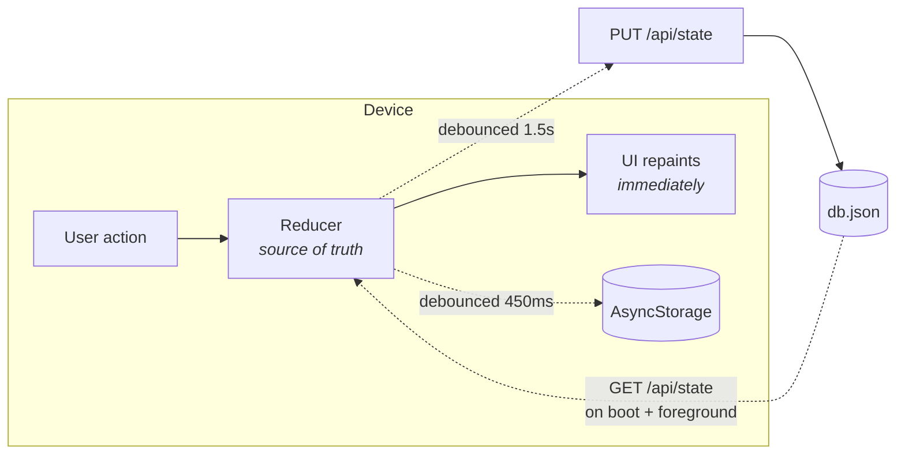

# NOTenough

**A fitness habit tracker for people who keep moving the bar.** Daily goals with local reminders, a
runner's stopwatch and interval timer, streak history, and an offline-first sync layer over a small
Node API.

The premise is in the name: when a target becomes comfortable, the app raises it.


| Today | Daily goals | Stopwatch |
|---|---|---|
|  |  |  |

| Intervals | Progress | Menu |
|---|---|---|
|  |  |  |

---

## Contents

- [Run it](#run-it) · [What it does](#what-it-does) · [Architecture](#architecture)
- [How the hard parts work](#how-the-hard-parts-work) — [sync](#offline-first-sync) · [auth](#auth-and-sessions) · [reminders](#reminders-that-cannot-drift) · [storage](#a-json-file-that-behaves-like-a-database)
- [Performance](#performance) · [Verification](#verification) · [Known limits](#known-limits)

---

## Run it

Two terminals, no configuration, no database to install.

```bash
# 1 — API
cd server && npm install && npm start     # http://localhost:4000

# 2 — app
npm install && npx expo start             # scan the QR with Expo Go
```

The app finds the API by itself: it reuses the LAN address Metro is already serving from, which is
by definition reachable from a physical phone. Set `EXPO_PUBLIC_API_URL` to override.

```bash
npm run typecheck          # strict TypeScript, no errors
npm run web                # run it in a browser instead
cd server && npm run smoke # 22 checks against the running API
npm run e2e                # 27 checks driving the real UI (needs `npm run web`)
```

---

## What it does

- **Daily goals** measured in minutes, reps, distance or a simple check-off, each with its own
  target, colour, icon and reminder time. One-tap templates for the common ones.
- **Local notifications** per goal, rebuilt from app state on every sign-in so the OS schedule
  cannot drift after a reinstall or a timezone change.
- **A runner's timer** — stopwatch with laps and splits, plus a work/recover interval mode with
  haptics on every phase change. The screen stays awake while it runs.
- **Progress** — current and best streak, a 7-day completion chart, a 4-week heat grid, and run
  history with pace.
- **Accounts** with a real backend, and a session that keeps working when the network does not.

---

## Architecture



The local reducer is always the source of truth for what is on screen. Disk and the API are both
background echoes of it, so **a tap never waits on I/O** and the UI cannot stall on a slow network.

```
App.tsx                    auth gate + providers
src/
  api/client.ts            typed fetch layer; every call returns ok|error, never throws
  navigation/              tab bar, slide-out menu, header, route table
  screens/                 Today, Goals, Timer, Progress, Plan, Settings, Auth
  features/
    goals/                 goal card + editor sheet
    timer/                 stopwatch engine, worklet clock formatters, 60fps digits
  state/
    AuthContext.tsx        session, token storage, the offline rule
    DataContext.tsx        reducer + persistence + sync + shared derived stats
    sync.ts                reconciliation rules (pull / push / conflict)
    selectors.ts           streaks, completion, projections — pure functions
  ui/                      design-system primitives (glass, progress, controls, toast)
  theme/theme.ts           the only place colours, radii and motion curves are defined
server/
  src/db.js                JSON store: serialised writes, atomic rename
  src/auth.js              scrypt hashing, JWT issuing, auth middleware
  src/routes/              /api/auth, /api/state
  scripts/smoke.js         end-to-end contract test
e2e/drive.mjs              Playwright drive of the running app
```

`server/` has [its own README](server/README.md) with the endpoint and configuration tables.

---

## How the hard parts work

### Offline-first sync

Last-write-wins on a client `updatedAt` stamp, decided in one place — [`src/state/sync.ts`](src/state/sync.ts):

| Situation | Result |
|---|---|
| Server has no state yet | push — first sync for this account |
| Server copy is newer | adopt it — another device got there first |
| Local copy is newer | push |
| Stamps equal | no-op |
| Server returns `409` | re-pull and adopt |

**A stale write is never retried.** Retrying a stale write is how sync layers quietly destroy data.

Two details that make the stamp trustworthy: it is applied by a wrapper around the reducer rather
than in each of its nine branches, and it is skipped when a case returns the same object — so a
redundant tap never marks the state dirty or fires a request. And a sync requested while another is
in flight is *queued*, not dropped; without that, edits made during a push would sit unsent until
the next unrelated edit happened to schedule one.

### Auth and sessions

> First sign-in requires the server. After that the session survives without it.

The token lives in SecureStore (Keychain / Keystore), the profile in AsyncStorage. On boot the app
paints from the cached profile immediately and validates against `/me` in the background. A network
failure keeps the user signed in and flags the session offline — **only a real `401` signs them
out.** Logging someone out of their own training data because of a train tunnel is a bug, not
security.

Server side: scrypt with a per-user salt and constant-time comparison, and byte-identical responses
for "unknown email" and "wrong password" so the endpoint cannot be used to enumerate accounts.
Password hashes never appear in a response body — [the smoke suite asserts it](server/scripts/smoke.js).

### Reminders that cannot drift

Toggling or editing a reminder cancels the previous notification id *before* scheduling a new one,
so the OS can never accumulate orphans. Sign-in rebuilds the whole schedule from app state, which
repairs the drift caused by a reinstall or a timezone change. Renaming a goal reschedules with the
new title — dispatches are asynchronous, so the mutation carries its overrides explicitly rather
than reading state that has not updated yet.

### A JSON file that behaves like a database

[`server/src/db.js`](server/src/db.js) is a single JSON file, but it does not behave like a
`fs.writeFile` call:

- every mutation is **serialised through one promise chain**, so concurrent requests cannot
  interleave a read-modify-write and lose an update;
- writes go to a temp file and are then **renamed**, which is atomic on every mainstream
  filesystem — a crash mid-write cannot truncate the database;
- registration re-checks email uniqueness **inside** that queue, because another request could have
  claimed the address between the read and the write.

Swapping in Postgres would not require touching a route.

---

## Performance

The three decisions that carry the most weight:

**Timer digits never re-render React.** They are a read-only `TextInput` whose `text` prop is written
from a worklet ([`TimerDigits.tsx`](src/features/timer/TimerDigits.tsx)). A `<Text>` bound to state
would put ~60 renders/second on the JS thread. Elapsed time is derived from `Date.now()` each frame
rather than accumulated from frame deltas, so backgrounding, a dropped frame or a busy JS thread
cannot make the clock drift. The frame loop only runs while the timer is active.

**State, actions, derived stats and sync are four separate contexts.** Components that only dispatch
— every button, stepper and timer control — subscribe to actions alone, so logging progress does not
re-render them. Streak and completion figures are computed once in the data layer instead of
independently in the header, Today and Progress: three passes over the full history per tap became
one.

**Real backdrop blur is iOS-only.** On Android `expo-blur` needs a `BlurTargetView` and repaints the
subtree every frame — the fastest way to make a list stutter. Android gets a layered translucent fill
that reads almost identically. Every other animation — press feedback, progress rings, the menu drag,
the tab indicator, shimmer placeholders — runs on the UI thread through Reanimated shared values.

Storage writes are debounced, coalesced per key, and flushed when the app backgrounds rather than
lost.

---

## Verification

No unit tests. Instead, two suites that exercise the real thing end to end:

**`cd server && npm run smoke`** — 22 checks against a running API: registration, duplicate
rejection, field-tagged validation errors, login, wrong-password handling, account enumeration
resistance, `401` on unauthenticated access, state push/pull, the stale-write `409` rule, and that a
token dies with its account.

**`npm run e2e`** — 27 checks driving the real UI in Chrome via Playwright
([`e2e/drive.mjs`](e2e/drive.mjs)):

```
register → land on Today → confirm the account exists via the API
log 2×500m → card reads 1.00 / 5.00 km → poll the API → server holds 1000m
add a goal from a template → open and dismiss the editor
stopwatch → assert the digits actually advance while running
intervals → progress → menu → settings
reload → still signed in, state intact, zero console errors
```

Data assertions are made **against the API, not the screen**, so a UI that renders the right thing
for the wrong reason still fails. Plus `npm run typecheck` (strict, clean) and a production Metro
bundle for Android and web.

Both suites have earned their keep. The browser drive caught a toast covering the header title, a
sync request being silently dropped when one was already in flight, and nested `<button>` elements
in the goal card — none of which typecheck or a bundle would ever surface.

---

## Stack

Expo SDK 57 · React Native 0.86 · React 19 · TypeScript (strict) · Reanimated 4 · Gesture Handler ·
react-native-svg · expo-notifications / secure-store / blur / haptics / keep-awake · Express 5 ·
Node `crypto` (scrypt) · JWT · Playwright

~7,800 lines of TypeScript across 39 modules, plus ~640 lines of backend JavaScript.

---

## Known limits

Deliberate, given the scope — and the next things I would build:

- The JSON store is single-node and holds the whole file in memory. Fine to a few thousand accounts;
  past that it wants a real database.
- Conflict resolution is last-write-wins over the whole state. Per-field merging is the next step
  for genuine multi-device use.
- Distance is entered by tap, not GPS. `expo-location` would make pace measured rather than
  self-reported.
- Scheduled notifications and haptics are the one thing the browser drive cannot prove — they need
  a device or an emulator.

## Licence

[MIT](LICENSE)
