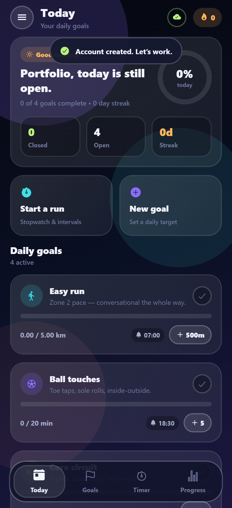
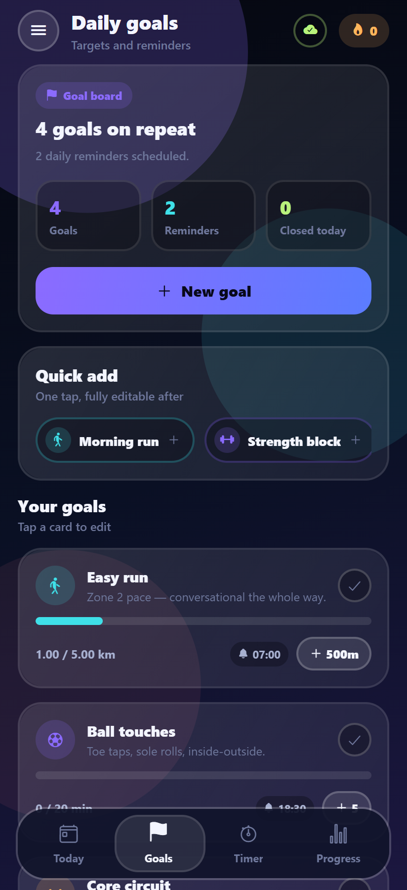
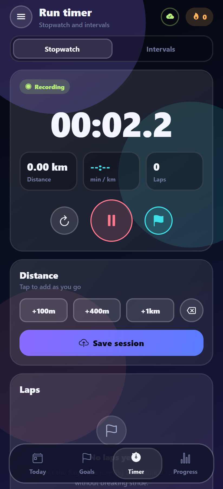
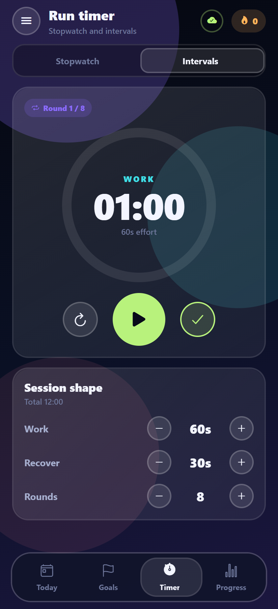
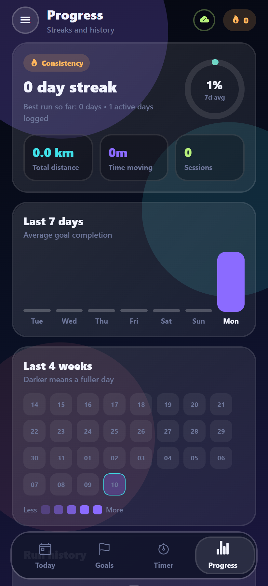
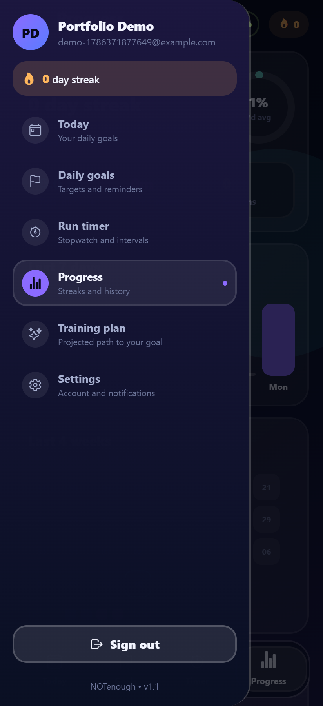

# NOTenough

A fitness habit tracker built with Expo SDK 57 and React Native 0.86, backed by a small Node API.

Daily goals with local reminders, an offline-first sync layer, a runner's stopwatch and interval
timer, and streak/progress history — behind a dark "liquid glass" interface.

The premise is in the name: when a target becomes comfortable, the app raises it.

---

## Screens

| Today | Daily goals | Stopwatch |
|---|---|---|
|  |  |  |

| Intervals | Progress | Menu |
|---|---|---|
|  |  |  |

---

## Run it

Two terminals, no configuration.

```bash
# 1 — API
cd server
npm install
npm start          # http://localhost:4000

# 2 — app
npm install
npx expo start     # scan the QR with Expo Go
```

The app finds the API automatically: it reuses the LAN address Metro is already serving from, which
is by definition reachable from a physical phone. Override with `EXPO_PUBLIC_API_URL` if needed.

Verify the backend on its own:

```bash
cd server && npm run smoke     # 19 end-to-end checks against a running server
```

---

## Architecture

```
App.tsx                    auth gate + providers
src/
  api/client.ts            typed fetch layer; every call returns ok|error, never throws
  navigation/              tab bar, slide-out menu, header, route table
  screens/                 Today, Goals, Timer, Progress, Plan, Settings, Auth
  features/
    goals/                 goal card + editor sheet
    timer/                 stopwatch engine, worklet clock formatters, 60fps digits
  state/
    AuthContext.tsx        session, token storage, offline rule
    DataContext.tsx        reducer + persistence + sync + shared derived stats
    sync.ts               reconciliation rules (pull / push / conflict)
    selectors.ts           streaks, completion, projections — pure functions
  ui/                      design-system primitives (glass, progress, controls, toast)
  theme/theme.ts           the only place colours, radii and motion curves are defined
server/
  src/db.js                JSON file store: serialised writes, atomic rename
  src/auth.js              scrypt hashing, JWT issuing, auth middleware
  src/routes/              /api/auth, /api/state
  scripts/smoke.js         end-to-end contract test
```

### Data flow

The local reducer is always the source of truth for what is on screen. Disk and the API are both
background echoes of it. A tap never waits on I/O, so the UI cannot stall on a slow network.

```
tap → reducer (instant) → debounced AsyncStorage write
                        → debounced PUT /api/state
boot → read cache (paint) → GET /api/state → reconcile
```

### Sync rules

Last-write-wins on a client `updatedAt` stamp, decided in one place ([`src/state/sync.ts`](src/state/sync.ts)):

| Situation | Result |
|---|---|
| Server has no state yet | push (first sync for the account) |
| Server copy is newer | adopt it — another device got there first |
| Local copy is newer | push |
| Stamps equal | no-op |
| Server returns 409 | re-pull and adopt |

A stale write is never retried. Retrying a stale write is how sync layers quietly destroy data.

`updatedAt` is stamped by a wrapper around the reducer rather than in each of its nine branches,
and it is skipped when a case returns the same object — so a redundant tap never marks the state
dirty and never triggers a request.

### Auth

First sign-in requires the server; after that the session survives without it.

The token lives in SecureStore (Keychain / Keystore), the profile in AsyncStorage. On boot the app
paints from the cached profile immediately and validates against `/me` in the background. A network
failure keeps the user signed in and flags the session offline — only a real `401` signs them out.
Logging someone out of their own training data because of a train tunnel is a bug, not security.

On the server: scrypt with a per-user salt, constant-time comparison, and identical responses for
"unknown email" and "wrong password" so the endpoint can't be used to enumerate accounts. Password
hashes never appear in a response body — the smoke test asserts it.

---

## Performance notes

The three decisions that carry the most weight:

**Timer digits never re-render React.** They are a read-only `TextInput` whose `text` prop is
written from a worklet ([`TimerDigits.tsx`](src/features/timer/TimerDigits.tsx)). A `<Text>` bound
to state would put ~60 renders/second on the JS thread. Elapsed time is derived from `Date.now()`
each frame instead of accumulating frame deltas, so backgrounding, a dropped frame or a busy JS
thread cannot make the clock drift. The frame loop only runs while the timer is active.

**State, actions, stats and sync are four separate contexts.** Components that only dispatch — every
button, stepper and timer control — subscribe to actions alone, so logging progress does not
re-render them. Streak and daily-completion figures are computed once in the data layer instead of
independently in the header, Today and Progress; that turned three passes over the full history per
tap into one.

**Real backdrop blur is iOS-only.** On Android `expo-blur` needs a `BlurTargetView` and repaints the
subtree every frame — the fastest way to make a list stutter. Android gets a layered translucent
fill that reads almost identically. Every other animation (press feedback, rings, menu drag, tab
indicator, shimmer) runs on the UI thread through Reanimated shared values.

Storage writes are debounced and coalesced per key, and flushed on background rather than lost.

---

## Notable implementation details

- **Reminders can't drift.** Toggling or editing one cancels the previous notification id before
  scheduling; sign-in rebuilds the entire OS schedule from app state, which repairs the drift caused
  by a reinstall or a timezone change. Editing a goal's title reschedules with the *new* title —
  dispatches are async, so the mutation carries its overrides explicitly.
- **The JSON store behaves like a database.** Writes are serialised through one promise chain, so
  concurrent requests can't interleave a read-modify-write; each write goes to a temp file and is
  renamed, which is atomic on every mainstream filesystem. Swapping in Postgres would not require
  touching a route.
- **Registration re-checks uniqueness inside the write queue**, because between the read and the
  write another request could have claimed the same address.
- **Offline is a first-class UI state**, not a crash: a tappable sync badge in the header, a banner
  on the sign-in screen naming the URL it tried, and the endpoint plus last-sync time in Settings.

## Stack

Expo SDK 57 · React Native 0.86 · React 19 · TypeScript (strict) · Reanimated 4 · Gesture Handler ·
react-native-svg · expo-notifications / secure-store / blur / haptics / keep-awake ·
Express 5 · Node crypto (scrypt) · JWT

## Known limits

Deliberate, given the scope:

- The JSON file store is single-node and holds everything in memory. Fine to a few thousand
  accounts; past that it wants a real database.
- Conflict resolution is last-write-wins at the whole-state level. Per-field merging would be the
  next step for genuine multi-device use.
- Distance is entered by tap, not GPS. Adding `expo-location` would make pace real rather than
  self-reported.
- No unit tests. Verification is a 22-check backend contract suite plus a 28-check Playwright drive
  of the running app (register → log progress → confirm it reached the API → add goals → run the
  timer → reload and confirm the session survived), on top of typecheck and a production bundle.
- Scheduled notifications and haptics are the one thing the browser drive cannot prove; those need
  a device or emulator.
